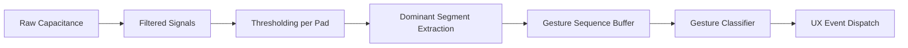
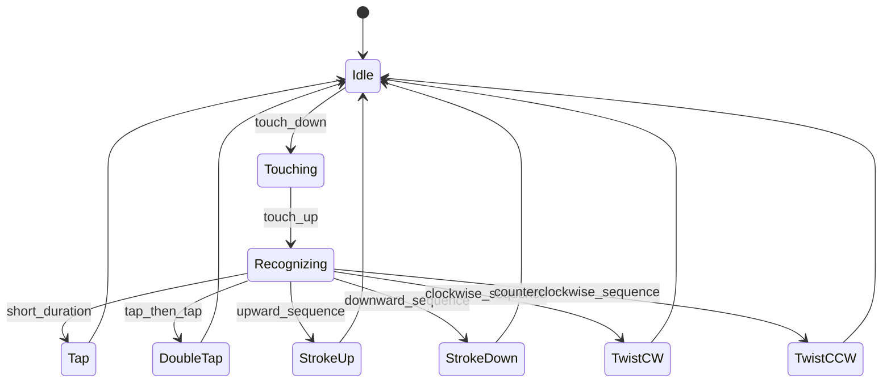

1. Executive Summary

The Naphome Egg introduces a natural, touch-based interaction surface at the very top of the device -- a crown-style capacitive gesture interface powered by the ESP32-S3's built-in touch sensing hardware.

This document defines the hardware, firmware, industrial design, and gesture-recognition pipeline required to support:
- Tap
- Double Tap
- Stroke Up / Down
- Twist Clockwise / Counterclockwise
- Optional: Center Tap Zone

The goal is a magical, buttonless interaction surface aligned with the aesthetic and functional principles of Naphome: natural, soothing, ambient, and intuitive.

---

2. Interaction Model Overview

The top of the egg functions as a gesture crown. Rather than discrete buttons, the system interprets patterns of capacitive activity over time and space.

Core Principles
- No mechanical parts
- No seams or visible sensors
- Fluid gesture exploration -- the user should feel they can "play" with the egg
- Immediate but gentle feedback via LED ring animation and sound

User Intent Mapped to Gestures

Gesture | User Intent | Typical Use
Tap | Wake / acknowledge | Waking the egg, pausing audio
Double Tap | "Next" | Next track, story, or scene
Stroke Up | Increase energy | Volume up, brighten ambient scene
Stroke Down | Reduce energy | Volume down, dim scene
Twist CW | Navigate forward | Cycle soundscapes or modes
Twist CCW | Navigate backward | Return to previous mode

---

3. Industrial Design Considerations

The capacitive gesture system must work through the top enclosure, not exposed:

Material Constraints
- ABS / PLA / resin / bamboo cap acceptable
- Best performance at 1-2 mm thickness
- Avoid:
- Metallic paints
- Foil decals
- Thick structural ribs directly above sensors

Shape and Geometry
- The Egg's existing curvature is ideal for capacitive fields:
- Smooth crown allows natural radial gestures
- Slight convexity helps segment differentiation
- The ring of segments is aligned with the circular top plane.

LED Integration
- Reactive LED-effects reinforce user actions:
- Pulse for tap
- Arc-fill for strokes
- Rotating chase for twist

---

4. Capacitive Electrode Architecture

4.1 Electrode Layout

The system uses eight radial segments arranged like a clock around the top crown:

```
        S0 (front)
   S7             S1
 S6                 S2
   S5             S3
        S4 (back)
```

Each segment is a copper pad on the PCB.

4.2 Optional Center Electrode

A center disk provides:
- More reliable single-tap detection
- Clear separation between "tap intent" and twist gestures

4.3 Recommended Geometry
- Ring pads shaped as curved trapezoids
- Radial symmetry ensures consistent detection
- Keep-out ground perimeter to isolate the field

---

5. ESP32-S3 Touch Sensing Architecture

The ESP32-S3 contains:
- Fifteen capacitive sensing channels
- Hardware filtering
- Edge detection
- Low-power scanning

Scanning Strategy
- Poll all ring pads every 10-20 ms
- Extract:
- Raw values
- Filtered values
- Touch threshold state
- Dominant segment index

Signal Tracking

For each gesture:
- Maintain a time-stamped sequence of dominant segment indices
- Track transitions between segments
- Detect patterns:
- Spatial transitions (twist)
- Vertical motion (stroke)
- Temporal spacing (double tap)

---

6. Gesture Pipeline (Signal -> Event)

Mermaid diagram:



---

7. Gesture Classification Logic

7.1 Tap
- Duration between 50-300 ms
- Only one segment active

7.2 Double Tap
- Two taps within <= 400 ms

7.3 Stroke Up / Down
- Consider segments in the front half:
- Stroke Up: movement -> toward S0
- Stroke Down: movement -> away from S0

7.4 Twist
- Orderly progression through segments
- Use signed wrap-around delta:

CW: 0 -> 1 -> 2 -> 3 ...
CCW: 0 -> 7 -> 6 -> 5 ...

- Require >= 3 sequential transitions
- Require duration 200-1500 ms

---

8. Firmware Architecture and FSM

Touch Gesture FSM



Event Output Format

JSON-like messages sent to SOM:

```
{"event":"tap"}
{"event":"double_tap"}
{"event":"stroke_up"}
{"event":"stroke_down"}
{"event":"twist_cw"}
{"event":"twist_ccw"}
```

---

9. UX Behavior Mapping

Gesture | Device State | Action
Tap | Idle | Wake plus gentle LED bloom
Tap | Playing audio | Play or pause playback
Double Tap | Any | Advance to next item
Stroke Up | Ambient scene | Increase intensity or volume
Stroke Down | Ambient scene | Dim or reduce volume
Twist CW | Browsing modes | Next mode
Twist CCW | Browsing modes | Previous mode

All gestures generate haptic-equivalent LED animations.

---

10. Reliability, Testing, Tolerances

10.1 Variation Handling
- Auto-baseline on boot
- Continuous dynamic threshold recalibration
- Noise filtering (IIR or boxcar)

10.2 ESD and Safety
- Add TVS diode if copper is exposed
- Keep high-current speaker traces away from crown

10.3 Environmental Testing
- High humidity
- Low humidity
- Cold start
- Warm electronics (amp under load)
- Children tapping rapidly (durability)

---

11. Manufacturing Notes and PCB Guidance

PCB Stack Recommendations
- Two-to-four layer board
- Capacitive pads on top layer
- Ground reference beneath with cutout region
- No stitching vias in touch area

Routing Constraints
- Keep I2S, PWM, and amp outputs out of crown zone
- Maintain large ground moat around pads

Provision for Future
- Design ring as break-apart nets:
- Can run S0-S7 as one pad for simpler revision
- Or keep full segmented control

---

12. Appendix

12.1 Example Pseudocode

```
void touch_poll() {
    sample = read_all_pads();

    if (touch_down_detected(sample))
        gesture_start();

    if (tracking)
        record_dominant_segment(sample);

    if (touch_up_detected(sample))
        classify_and_emit_gesture();
}
```

12.2 Segment Angle Table

Segment | Angle
S0 | 0 deg
S1 | 45 deg
S2 | 90 deg
S3 | 135 deg
S4 | 180 deg
S5 | 225 deg
S6 | 270 deg
S7 | 315 deg

12.3 Glossary
- Dominant Segment -- segment with highest differential capacitance
- Sequence Buffer -- ordered list of touched segments
- Wrap-Around Delta -- angle difference considering circular topology

---

End of Document

If you would like, I can now:

- Export this Markdown to HTML
- Export it to a styled PDF
- Add Naphome branding and colors
- Add diagrams as images instead of Mermaid

Just let me know what you need next.
